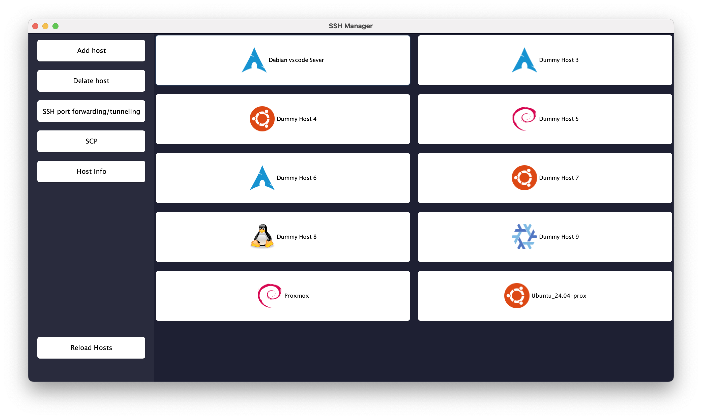
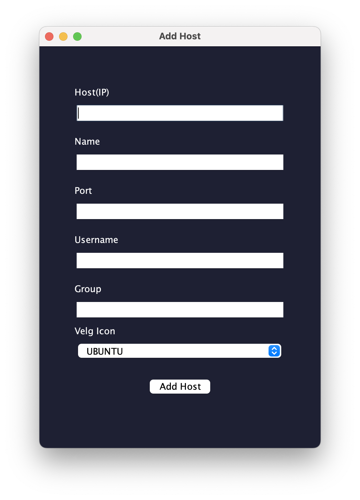
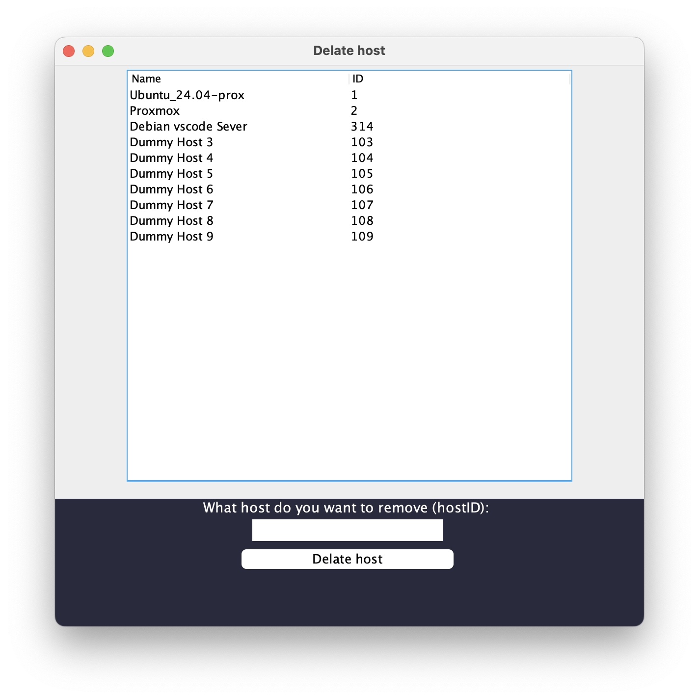
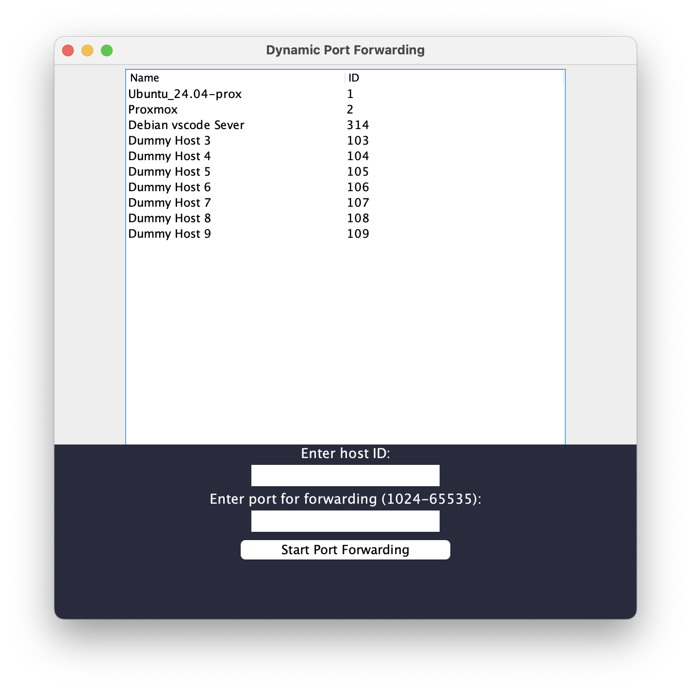
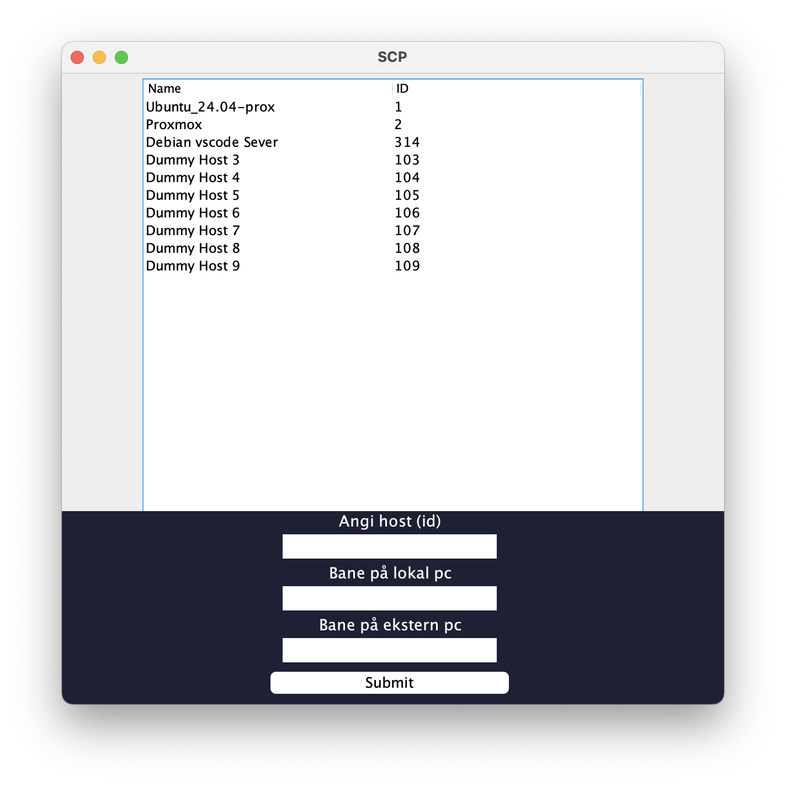
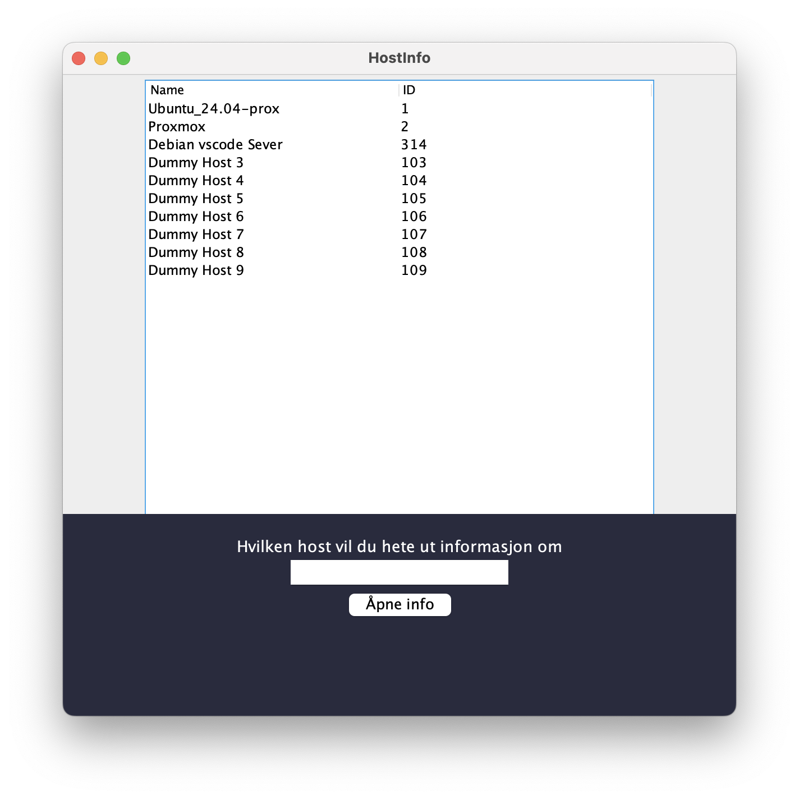
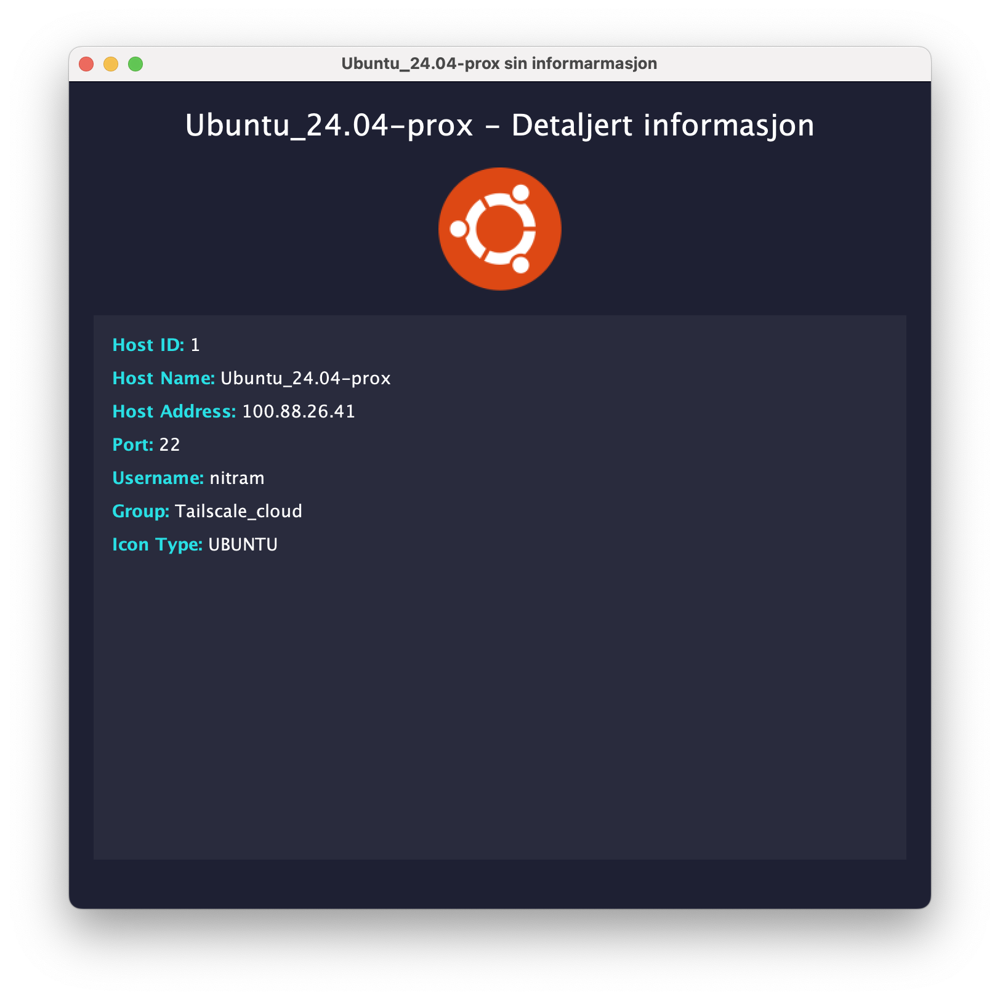

# Programmet kjører ikke enda, men her er koden


## Video om funksjonalitet
- [Demonstrasjonsvideo](https://www.youtube.com/watch?v=trXMLGWL6zs)

## TL;DR
- Et program for å administrere SSH-hoster, sette opp SSH port forwarding og overføre filer med SCP.
- Kjør programmet med `mvn exec:java -Dexec.mainClass="no.uib.inf101.sshmanager.sshmanager"` fra rotmappen til prosjektet.

## Om programmet
`ssh-manager` er et program som hjelper deg med å holde styr på og utføre ulike operasjoner ved hjelp av SSH-protokollen. Har hentet litt inspirasjon fra programmet [Termius](https://termius.com/)


**Funksjoner:**
1.  Oversiktlig liste over SSH-tilkoblingene dine.
2.  Legge til og fjerne hoster.
3.  Sette opp SSH port forwarding.
4.  Sende filer via SCP (Secure Copy Protocol).
5.  Vise detaljert informasjon om hver host.

Programmet sorterer hostene basert på gruppen du tilordner dem.
- Hoster blir gruppert etter gruppenavnet du angir.
- Eksempel: Alle hoster med gruppenavn `Dev` vil vises samlet i grensesnittet.

**Konfigurasjon:**
Du kan legge til hoster på to måter:

1.  **Via JSON-konfigurasjonsfil:** Rediger `src/main/java/no/uib/resources/config.json`.
	- Filstrukturen ser slik ut:
	```json
	{
	  "hosts": [
		{
		  "id": "1",
		  "name": "Navn som vises i GUI",
		  "hostname": "IP-adresse eller vertsnavn",
		  "port": 22,
		  "username": "Brukernavn for tilkobling",
		  "group": "Gruppenavn for sortering",
		  "icon": "Enum-verdi for ikon (f.eks. DEBIAN)"
		},
		{
		  "id": "2",
		  "name": "Proxmox",
		  "hostname": "100.119.72.86",
		  "port": 22,
		  "username": "root",
		  "group": "Proxmox",
		  "icon": "DEBIAN"
		}
	  ]
	}
	```
2.  **Via programmets grafiske brukergrensesnitt (GUI).**

Det er også mulig å legge til flere ikoner:
- Legg til ikonet som en `.png`-fil.
- Oppdater enum-klassen `src/main/java/no/uib/inf101/sshmanager/model/HostIcon.java`.

## Hvordan kjøre programmet

1.  **Klon repositoriet:**
	```bash
	git clone https://git.app.uib.no/ii/inf101/25v/assignments/martin.e.knutsen_empty.git
	cd martin.e.knutsen_empty/
	```

2.  **Kjør fra IDE (f.eks. Visual Studio Code):**
	- Åpne prosjektmappen i IDE-en din.
	- Kjør hovedklassen `no.uib.inf101.sshmanager.sshmanager`.

3.  **Kjør fra terminalen:**
	```bash
	mvn exec:java -Dexec.mainClass="no.uib.inf101.sshmanager.sshmanager"
	```

## FAQ (Ofte stilte spørsmål)

**Hva om jeg bruker SSH-nøkler for autentisering?**

Hvis du bruker SSH-nøkler, er det et par måter å håndtere det på:

-   **Metode 1: Standard nøkkelplassering (`~/.ssh`)**
	-   Hvis nøkkelen din ligger i `~/.ssh`-mappen, kan du kopiere den offentlige nøkkelen til serveren med `ssh-copy-id <bruker>@<vertsnavn>` (eller `ssh-copy-id -i path/to/your/public_key.pub <bruker>@<vertsnavn>` hvis den har et annet navn enn `id_rsa.pub` etc.).
	-   Alternativt kan du manuelt legge til innholdet av den *offentlige* nøkkelfilen din (`.pub`) på en ny linje i `~/.ssh/authorized_keys`-filen på serveren.
	-   **NB!** `ssh-copy-id` fungerer kanskje ikke hvis serveren har deaktivert passordautentisering (`PasswordAuthentication no` i `/etc/ssh/sshd_config`). I så fall må du enten aktivere passordautentisering midlertidig (husk å restarte SSH-tjenesten: `sudo systemctl restart sshd` eller lignende) eller bruke den manuelle metoden.

-   **Metode 2: SSH Agent**
	-   Hvis nøkkelen ligger et annet sted, eller hvis den er passordbeskyttet, kan du legge den til i din lokale `ssh-agent`.
	-   Start `ssh-agent` hvis den ikke kjører (ofte automatisk på moderne systemer). Du kan sjekke med `eval $(ssh-agent -s)`.
	-   Legg til nøkkelen med `ssh-add /sti/til/din/private_nøkkel`. Du blir spurt om passordet hvis nøkkelen er beskyttet.
	-   For mer info om å starte `ssh-agent` automatisk på Linux, se f.eks.: [Start ssh-agent on login](https://stackoverflow.com/questions/18880024/start-ssh-agent-on-login)

*Merk: Funksjonalitet for direkte håndtering av SSH-nøkler i selve programmet ble ikke implementert på grunn av tidsbegrensninger.*


## Bilder







